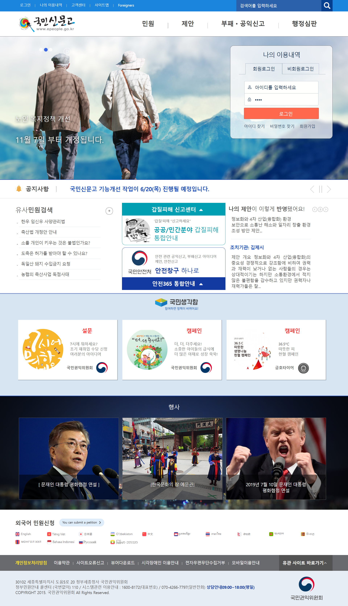

# ePeople

국민신문고를 카피해서 만든 제 첫번째 프로젝트 입니다.
<a href="https://www.epeople.go.kr/">(원본 : https://www.epeople.go.kr/ )</a>
메인페이지 1개, 서브페이지 5개로 이루어져있으며
버전에 상관없이 서브페이지는 모두 같습니다.
게시판형 서브페이지의 경우 ver2는 json을 이용하였습니다.

<dl>
<dt>ver1</dt>
<dd>
HTML5, CSS3 를 이용하여 국민신문고의 모습을 최대한 똑같이 구현하는 것을 목표로 만들었습니다.  

</dd>
<dt>ver2</dt>
<dd>
ver1에서 jQuery를 추가하여 메인슬라이드 등 간단한 인터렉션 효과를 추가 한 버전입니다. 
width 100% 상태로 메인슬라이드를 구현하고 싶어서 중복되는 Grid UI를 없애고 디자인적인 변화도 주었습니다.  

</dd>
</dl>
