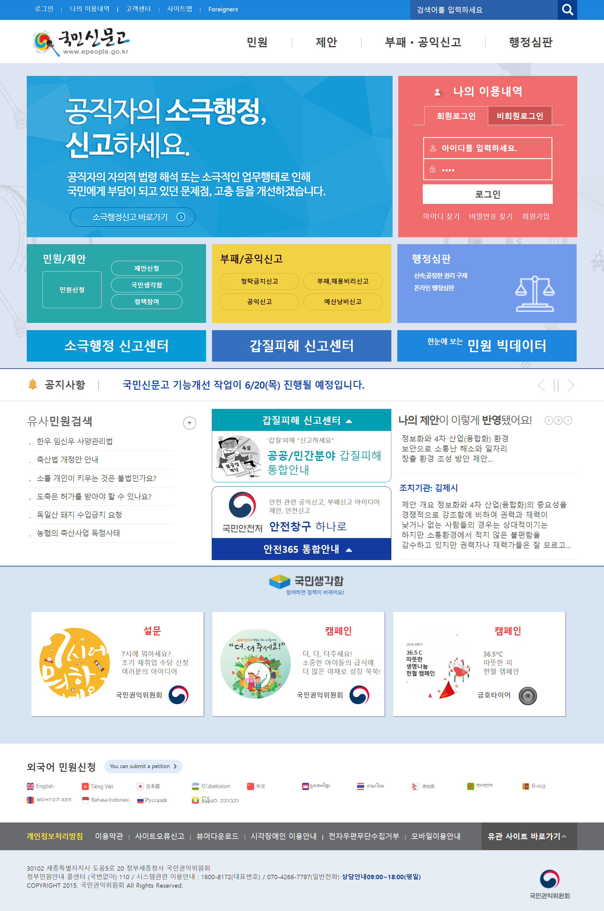

# ePeople

국민신문고를 카피해서 만든 제 첫번째 프로젝트 입니다.
메인페이지 1개, 서브페이지 5개로 이루어져있으며
버전에 상관없이 서브페이지는 모두 같습니다.
게시판형 서브페이지의 경우 ver2는 json을 이용하였습니다.

<dl>
<dt>ver1</dt>
<dd>
HTML5, CSS3
HTML5, CSS3 를 이용하여 국민신문고의 모습을 최대한 똑같이 구현하는 것을 목표로 만들었습니다. 
첫 프로젝트인 만큼 HTML, CSS와 친해지기 위하여 원본의 소스를 참고하지 않고 스스로 만들었습니다. 
SEO를 고려하여 meta태그를 사용하였고 문서작업만 한 프로젝트인 만큼 
브라우저 호환성도 고려하여 ie7까지 깨지지 않고 호환되도록 작업하였습니다. 
</dd>
</dl>
